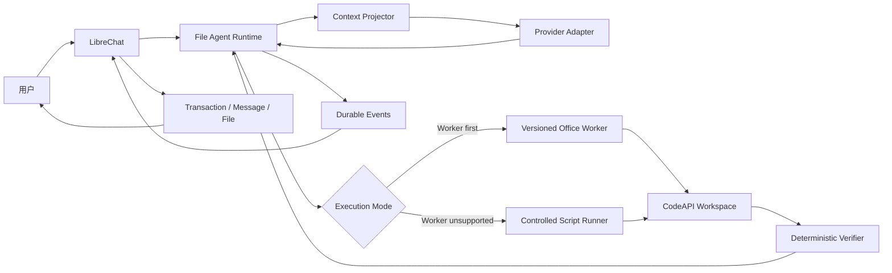

# LibreChat File Agent Runtime 开发需求说明

Date: 2026-08-03

Updated: 2026-08-04

Status: approved for repository development. This document authorizes scoped
non-production implementation and testing only. It does not authorize a
production package, deployment, customer traffic, or customer-file acceptance.
Milestones 1-3 are implemented and frozen. M3-R is a separate controlled Word
release track. Office M3.1 is the next product-development milestone; controlled
task-level scripting remains M4 and must not be mixed into M3.1.

## 一、项目背景

当前 LibreChat 复杂文件任务仍可能在普通聊天 Agent 循环中执行。已确认的问题包括：

- 任务状态主要依赖聊天上下文，模型调用结束后缺少独立任务事实；
- 失败后重复生成 10K 至 20K 字符的完整脚本；
- 脚本、stdout、错误和历史工具结果持续放大上下文；
- 工具输出虽然不同，但验证状态没有改善，仍被误判为进展；
- 同一文件反复修改和校验，最终撞到 LangGraph recursion limit；
- 文件已经生成，但消息、附件和 final event 未同步完成时，前端可能继续显示生成中；
- 任务中断后可能重新调用模型、CodeAPI 或交付链路，增加重复费用和重复产物风险。

本项目不通过增加提示词、固定工具次数或继续扩展原 Agent 主循环解决问题。复杂 Office
文件任务应进入独立 File Agent Runtime，由 Runtime 管理任务状态、上下文、执行、验证、
恢复和停止条件；LibreChat 保留用户、会话、计费、消息、文件与下载卡。

## 二、建设目标

### 2.1 业务目标

1. 用户在 LibreChat 上传 Office 文件并要求修改、生成或转换时，可进入可恢复的文件
   任务，而不是继续依赖开放式聊天工具循环。
2. 同一任务跨多个用户轮次仍使用同一个 Runtime task 和 CodeAPI workspace。
3. 模型只接收当前任务所需的有界上下文，不重复加载完整聊天、脚本和 stdout。
4. 失败修复复用稳定脚本、候选文件和验证结果，不重复执行等价动作。
5. 只有确定性 Verifier 通过的最终文件才能进入 LibreChat 下载卡和“生成的文件”。
6. Runtime、LibreChat、CodeAPI 或浏览器中断后可以恢复，且不重复计费和生成产物。
7. 普通聊天、轻量文件问答和未支持的文件类型保持现有 LibreChat 原生路径。

### 2.2 M3-R 受控试点目标

M3-R 只试点“上传一个 DOCX 后使用 `word-edit-v1` 修改并交付一个 DOCX”。它不包含
Excel、PPTX、跨格式 Compose 或动态 Script。只有真实非生产 Word 联合验收、生产组合、
持久化、feature flag、回滚和发布门禁分别通过后，才可对 `vip998` 受控开放。

### 2.3 M3.1 产品目标

M3.1 面向咨询公司办公场景，在不修改 M3 Word 契约的前提下新增正式 Excel、PowerPoint
和跨格式 Office Compose Worker/Verifier。架构和任务清单分别见：

- `docs/FILE_AGENT_RUNTIME_OFFICE_M3_1_ARCHITECTURE.md`；
- `docs/FILE_AGENT_RUNTIME_OFFICE_M3_1_DEVELOPMENT_TASKS.md`。

M3.1 的 Office 格式范围仅为 `.docx`、`.xlsx` 和 `.pptx`；旧 `.doc`、`.xls`、`.ppt`
及含宏格式不自动继承支持结论。

### 2.4 非目标

- 不复制 Claude Code、Codex CLI 或 Codex app-server；
- 不在 LibreChat API 进程内重写完整 Runtime；
- 不开放任意 Shell、Web、MCP 或多 Agent 编排；
- 不新增第二套用户、文件、价格、余额或消息系统；
- 不把提示词、文件名或新 artifact hash 当作完成依据；
- 不支持图片生成；用户已上传图片仍可被 Word/PPT Worker 使用；
- 不提供 ZIP fallback；一次对话最多交付三个用户明确要求的独立文件；
- 本阶段不部署生产。

## 三、必须复用的现有基线

开发必须在现有模块上演进，不新建平行 Runtime：

```text
services/file-agent-runtime/
services/librechat-file-agent-connector/
```

必须保留并回归验证：

- Runtime `prepare -> plan -> execute -> verify -> repair -> publish` 状态机；
- 幂等 task submission、itemId、model call journal 和 usage event；
- 有界 `ContextProjector`；
- Runtime FIFO capacity queue；
- Connector capability routing 和 feature flag/allowlist；
- Mongo delivery record、billing snapshot、usage ingestion 和 artifact receipts；
- HMAC service scope；
- `processCodeOutput()` 作为生成文件进入 LibreChat 的唯一入口；
- 预分配 assistant message、GenerationJobManager final 和恢复 reconciler；
- 最多三个可见产物；
- 已上线的公共 progress ledger 和 recursion limit 作为最终保险丝。

现有 XLSX POC 不删除、不改成 Word 特例；它继续作为 Runtime 状态、幂等、恢复和
Connector 回归样本。

## 四、目标架构



唯一事实源：

| 数据 | 唯一事实源 |
| --- | --- |
| 用户、租户、会话、消息 | LibreChat |
| 上传文件及所有权 | LibreChat |
| CodeAPI session 和文件内容 | CodeAPI |
| task、plan、item、checkpoint、verification | Runtime |
| 模型凭据与 route 映射 | Runtime Secret/Provider 配置 |
| 模型价格、余额、transaction | LibreChat |
| 用户可见生成文件与下载卡 | LibreChat |

## 五、实施范围与优先级

### P0 已完成：契约和循环治理

- Action Envelope v1；
- Word capability profile；
- 规范化 Verification Result；
- Progress Vector 和无进展状态转换；
- 上下文投影扩展；
- 相关单元测试和现有 XLSX 回归。

### P0 已完成：跨轮次恢复

- Conversation 与 active task 的持久绑定；
- submit turn 与 steer turn 区分；
- 一个 task 跨多个 LibreChat 用户/助手消息轮次；
- 多活动任务歧义处理；
- stale CodeAPI ref 的重新 prime/rebind 契约。

### P0 已完成：Word Worker 和 Verifier

- DOCX inspect、transform、patch、verify、publish；
- 原始输入只读；
- 稳定脚本和候选文件路径；
- 结构验证、任务断言和渲染验证；
- 一个最终 DOCX artifact。

### P1 下一里程碑：Office M3.1 Worker Suite

- 保持 `word-edit-v1` 全量回归和语义冻结；
- 将 XLSX 固定 POC 升级为 `xlsx-edit-v1` Worker/Verifier；
- 新增 `pptx-edit-v1` Worker/Verifier；
- 新增 `office-compose-v1`，支持 Excel/Word 数据生成一个完整 PPTX；
- 新增 Office feature scanner、统一 Inspector、source facts 和 format-specific Verifier；
- Excel、PPTX、Compose 使用独立 feature flag 和非生产验收报告。

### P1 后续里程碑：受控脚本能力

- Worker 优先、Script 降级的确定性路由；
- 版本化 `script.create.v1` / `script.patch.v1`；
- 稳定脚本路径、revision、hash、受控 patch 和执行去重；
- 任务目录隔离、输入只读、默认无网络、无凭据和无临时安装；
- 动态脚本输出接入已有独立 Verifier、Progress Vector 和 artifact 交付；
- 相同输入与脚本不重复执行，等价 patch 在 CodeAPI 副作用前停止。

该能力是完整 File Agent Runtime 产品目标的一部分，也是扩大到陌生复杂任务前的阻塞项，
但不回填或扩大已冻结的 Word M3 范围。

### P1 后续：任务状态 UI

- 聊天内轻量任务状态；
- 等待用户输入、取消、失败和完成状态；
- 不展示完整脚本、stdout、Prompt 或内部路径。

### P1 后续：真实非生产联合验收

- 真实非生产 model relay；
- 真实非生产 CodeAPI；
- 完整 LibreChat API/client；
- 测试账号与仓库 fixture；
- 不使用生产 Key、生产用户文件或生产 transaction。

## 六、功能需求

### FR-001 确定性任务路由

进入 Runtime 必须同时满足：

1. feature flag 开启；
2. 当前账号在 allowlist；
3. 当前用户、租户和 conversation 文件所有权通过；
4. 用户明确要求修改、生成、转换或交付文件；
5. Runtime capability 支持输入 MIME、输出 MIME 和 capability profile；
6. 输入已 prime 到任务授权的 CodeAPI session；
7. 模型 route 和 LibreChat billing snapshot 可用。

以下请求保持原生路径：

- 普通聊天；
- 无文件标题生成；
- 只基于短预览回答；
- 图片理解；
- Runtime 未声明支持的文件类型；
- feature flag 或 allowlist 未命中。

Runtime 返回 taskId 后禁止自动回退原 Agent，避免双执行和双计费。

### FR-002 Task Contract v1.1

保留现有 `schemaVersion: 1.0`，新增
`taskContractVersion: office-file-agent.v1.1`。Runtime capability discovery 必须同时
声明支持的 contract 和 profile，现有 `office-file-agent.v1` 行为保持不变。

Task Manifest 至少包含：

```json
{
  "schemaVersion": "1.0",
  "taskContractVersion": "office-file-agent.v1.1",
  "taskType": "office_transform",
  "intent": "修改上传的 Word 文档并交付修订版",
  "acceptance": [],
  "identity": {
    "tenantScope": "opaque-tenant-ref",
    "userScope": "opaque-user-ref",
    "conversationRef": "opaque-conversation-ref",
    "messageRef": "opaque-message-ref"
  },
  "model": {
    "modelRouteId": "file-agent-primary",
    "capabilityProfile": "word-edit-v1"
  },
  "billingRef": "opaque-billing-snapshot-ref",
  "execution": {
    "executor": "codeapi",
    "sessionId": "storage-session-id",
    "workspaceRoot": "/mnt/data/.agent/{taskId}"
  },
  "inputs": [],
  "limits": {
    "maxVisibleArtifacts": 1,
    "maxWallTimeSeconds": 900,
    "maxContextCharacters": 12000
  }
}
```

Manifest 不得包含 API Key、base URL、价格表、用户对象、完整聊天历史或文件正文。

### FR-003 Action Envelope

模型计划中的每个 Action 必须符合版本化 schema：

```json
{
  "schemaVersion": "1.0",
  "objective": "修复目标表格并保留其他内容",
  "worker": "word.transform.v1",
  "inputRefs": ["input:source-docx"],
  "targetRef": "candidate:working-docx",
  "parameters": {},
  "expectedChange": ["table.structure"],
  "verificationProfile": "word-structure-v1",
  "onFailure": "replan"
}
```

约束：

- `worker` 必须来自 capability profile allowlist；
- `parameters` 必须通过对应 Worker JSON Schema，序列化后不超过 8 KiB；
- Action 不得携带 shell command、完整脚本、凭据、价格、URL 或任意绝对路径；
- `inputRefs` 和 `targetRef` 必须解析到当前 task 授权范围；
- `verificationProfile` 必须由 Runtime 选择或复核，模型不能关闭基础验证；
- Action signature 必须包含 worker、目标、规范化 parameters、expectedChange 和
  verification profile，不得只使用 action kind 或 summary；
- `summary` 仅用于展示，不能参与进展或幂等判断。

### FR-004 Runtime 状态机

保留现有状态并增加明确语义：

```text
accepted
-> preparing
-> planning
-> executing
-> verifying
-> publishing
-> completed
```

分支：

```text
verifying -> repairing -> executing
planning/executing/repairing -> needs_input
任何活动状态 -> canceled
任何活动状态 -> failed
needs_input -> planning
```

状态转换必须由持久事实驱动：

- CodeAPI 生成文件不等于 completed；
- Verifier passed 后才能 publishing；
- Runtime completed 只表示已产生通过验证的 CodeAPI artifact ref；
- LibreChat completed 必须等待 usage、artifact、message、final event 和 generation job
  全部完成。

### FR-005 持久 Workspace

首版复用现有 CodeAPI session 和 `/mnt/data`，不新增一套上传链路或七个 Workspace API。

目录约定：

```text
/mnt/data/.agent/<taskId>/
  input/
  scripts/
  internal/
  output/
  checkpoint/
```

要求：

- `input/` 只读；
- `scripts/` 使用稳定文件名和 revision/hash；
- `internal/` 保存中间数据、渲染缓存和验证证据，不进入下载卡；
- `output/` 只保存候选和最终交付物；
- 同一 workspace 写操作串行化；
- 所有路径必须位于 task root，拒绝路径穿越和符号链接逃逸；
- itemId 作为 CodeAPI 外部幂等键；
- session 失效时返回稳定 `INPUT_REF_STALE`，不创建第二个 task；
- Connector 重新 prime 后，通过受控 rebind/steer 更新 ref 并从 checkpoint 恢复。

### FR-006 上下文投影

每次模型调用只允许包含：

- 当前目标与验收标准；
- phase、plan revision、instruction revision；
- 输入、脚本、候选输出的逻辑名称和 hash；
- 最近最多 8 个有效 item 摘要；
- 最新 Verification Result；
- Progress Vector 和剩余安全预算；
- 与当前失败直接相关的有限错误证据。

禁止投影：

- 完整聊天历史；
- 完整脚本；
- 完整 stdout/stderr；
- 文件正文；
- 已解决错误的重复记录；
- API Key、URL、价格和 LibreChat 内部对象。

默认序列化上限为 12,000 字符。超过预算必须先裁剪旧 item 和非关键证据，并产生
幂等 `context.compacted` 事件；不得静默突破预算。

### FR-007 Verification Result

Verifier 必须返回结构化结果：

```json
{
  "schemaVersion": "1.0",
  "profile": "word-structure-v1",
  "profileVersion": "1.1.0",
  "passed": false,
  "requiredAssertionCount": 8,
  "passedAssertionCodes": ["ooxml.zip", "xml.parse"],
  "failedAssertions": [
    {
      "code": "word.relationship.missing",
      "class": "STRUCTURE",
      "summary": "Required relationship is missing",
      "evidenceRef": "workspace://verification/verify-2.json"
    }
  ],
  "artifact": {
    "logicalId": "candidate:working-docx",
    "revision": 2,
    "sha256": "...",
    "size": 141928
  },
  "metrics": {
    "pageCount": 4,
    "tableCount": 7
  }
}
```

`summary` 和 evidenceRef 不参与 fingerprint。Fingerprint 使用规范化 profile/version、
断言 code、artifact logical ID 和确定性 metrics。

### FR-008 Progress Vector 与循环停止

Runtime 在每次 verify 后保存：

```text
phase
target artifact logical ID
verification profile/version
sorted passed required assertion codes
sorted failed assertion codes
normalized error class
closed plan node IDs
script hash
artifact hash
```

有效进展仅包括：

- required failed assertion 集合严格减少；
- required passed assertion 数增加；
- 必要计划节点被确定性关闭；
- 用户补充信息解除 `needs_input` 阻塞。

以下变化不能单独算进展：

- artifact 或 script hash 变化；
- filename、revision 或 stdout 变化；
- 模型 summary、错误措辞或脚本行号变化；
- 生成新的候选文件。

处理规则：

1. 第一次无进展：发出 `progress.stalled`，进入 repairing，并要求改变修复策略；
2. 重新规划后仍是相同失败断言和等价 Action signature：在调用 CodeAPI 前转
   `needs_input`；
3. 用户无法提供信息且 Runtime 已有明确不可修复结论时转 `failed`；
4. wall time、模型调用、CodeAPI 调用、磁盘和输出文件数只作为安全硬上限；
5. 不允许通过改文件名、改临时路径或改错误文本绕过无进展判断。

### FR-009 Word Worker v1

Worker ID：

```text
word.inspect.v1
word.transform.v1
word.patch.v1
word.validate.v1
```

首版必须支持：

- 一个 `.docx` 输入；
- 读取段落、表格、基础样式、页眉页脚和 OOXML part 清单；
- 支持文字替换、段落追加（可引用已有样式）和指定表格单元格替换；
- 将候选文件写入稳定 output path；
- patch 必须基于 expected base hash，冲突时拒绝，不宽松覆盖；
- 每次修改记录 worker version、parameters digest、before/after hash；
- 验证通过后发布一个 `.docx` artifact。

首版不支持：

- `.doc`、`.docm`、宏和嵌入可执行对象；
- 任意复杂域代码；
- 没有专项 verifier 的批注和修订痕迹保证；
- Word 桌面端像素级一致性承诺；
- 一次任务生成多个版本供用户选择。

### FR-010 Word Verifier v1

基础断言必须包含：

```text
ooxml.zip.valid
ooxml.content_types.valid
xml.parts.parseable
word.document.present
word.relationships.resolved
word.comments.no_orphans
word.required_changes.applied
word.render.succeeded
```

可选指标：

- page count；
- paragraph/table/image count；
- key heading presence；
- required text/table assertions；
- source/candidate structural delta。

规则：

- 基础断言不能被模型关闭；
- 业务断言来自 manifest acceptance 的结构化映射，不直接执行用户文本；
- 渲染失败不能标记 passed；
- “可打开”不等于内容正确或设计质量合格；
- 完整渲染文件和详细诊断保存在 internal，不进入用户下载文件。

### FR-011 跨轮次 active task

Conversation 与 Runtime task 必须分离。一个 Runtime task 可以绑定多个 LibreChat turn，
但每个用户轮次必须拥有自己的 userMessageId、assistantMessageId 和 streamId。

新增持久绑定至少包含：

```json
{
  "user": "user-id",
  "tenantId": null,
  "conversationId": "conversation-id",
  "taskId": "runtime-task-id",
  "capabilityProfile": "word-edit-v1",
  "status": "needs_input",
  "workspaceRef": "opaque-workspace-ref",
  "latestSequence": 18,
  "updatedAt": "..."
}
```

路由规则：

- 本轮有新文件且明确是新任务：创建新 task；
- 本轮无文件、用户表达“继续/按刚才要求修改”，且仅有一个同 conversation 活动 task：
  创建新的 turn delivery，并 steer 原 task；
- 同 conversation 有多个活动 task：不得猜测，返回可选择的任务摘要；
- task 已 completed/failed/canceled：不得静默恢复执行；
- 不同用户、租户或 conversation 不能引用该 active task；
- steer 不改变原始输入授权、taskId 或 workspace；
- 新 turn 不修改上一轮已保存的 assistant message，不创建重复 sibling。

Task 级 event cursor、usage receipts 和 artifact receipts 必须只有一个权威记录；turn
delivery 只负责当前用户轮次的消息和 finalization，不能重复消费历史副作用。

### FR-012 幂等与恢复

必须覆盖以下中断窗口：

- 模型返回后、journal completed 前；
- journal completed 后、Runtime item completed 前；
- CodeAPI 执行成功后、item checkpoint 前；
- artifact 已进入 LibreChat file、receipt 未完成前；
- assistant message 已保存、final event 未完成前；
- final event 已保存、generation job 未完成前。

恢复要求：

- 相同 model callId 不产生第二次付费调用；
- 相同 itemId 不产生第二次 CodeAPI 副作用；
- usageEventId 不重复 transaction；
- artifactId 不重复 LibreChat file；
- 同一 turn 不创建第二个 assistant message；
- SSE 丢失后可从持久 sequence 和消息状态恢复；
- non-idempotent provider pending 状态进入 `needs_input`，不得自动重发。

### FR-013 Usage 与计费

Runtime 继续只报告：

```text
inputTokens
cacheReadTokens
cacheWriteTokens
outputTokens
```

LibreChat 使用 task 提交时冻结的 billing snapshot 计算费用。要求：

- task 执行中后台改价不影响该 task；
- 新 task 使用新价格；
- 所有内部模型调用归入对应对话轮次和 task；
- Runtime 不保存美元费用、余额或完整价格配置；
- 没有有效 billing snapshot 时，计费任务不得进入 Runtime。

### FR-014 Artifact 与最终消息

- Runtime 只发布 Verifier passed 的 artifact；
- artifact 必须包含 logical ID、revision、name、MIME、size、sha256、CodeAPI ref 和
  verification profile/version；
- Connector 必须通过 `processCodeOutput()` 落库；
- internal、script、日志、渲染缓存和中间候选不得进入下载卡；
- Word 首版最多一个用户可见 artifact；
- 最终消息只能引用已完成 artifact receipt 的文件；
- usage、artifact、message、final event 和 generation job 全部完成后才能把 delivery
  标记为 completed；
- 刷新前后必须显示相同最终消息和下载卡。

### FR-015 任务状态 UI

聊天中显示轻量状态：

```text
任务名称
当前阶段
最近完成动作
候选产物 revision
验证通过项/待处理项摘要
等待用户输入或失败原因
```

允许命令：取消、继续、补充要求、查看简要验证结果。首版不提供工作流编辑器、完整
trace 浏览器或原始终端输出。

### FR-016 受控 Script 模式

Script 模式不是任意 Shell，也不修改 LibreChat 或 Runtime 项目源码。M4 必须使用新的
版本化 task contract 和 capability profile，不得把动态脚本字段塞入已冻结的
`office-file-agent.v1.1` / `word-edit-v1`。

路由顺序：

```text
inspect
-> capability match
-> deterministic Worker when supported
-> controlled Script only when Worker cannot satisfy frozen acceptance assertions
-> independent verify
-> publish only after verifier passed
```

允许动作：

```text
script.create.v1
script.patch.v1
script.execute.v1
```

约束：

- `script.create.v1` 每个 task 和语言只允许创建一个稳定主脚本；
- Script 源码和 patch 不进入普通 Action `parameters`。Provider Adapter 必须先把首次完整
  脚本或后续 patch 持久化为 journal-backed content receipt，并只向 Action 暴露不透明的
  `scriptDraftRef` 或 `patchRef`；receipt 必须绑定 model callId、内容 hash 和大小；
- 首次脚本 content receipt 默认不超过 64 KiB，单次 patch 默认不超过 16 KiB；超限时
  任务进入 `needs_input` 或失败，不允许拆成多次完整脚本规避上限；
- 首次创建后只允许 `script.patch.v1` 修改现有 revision，不重新提交完整脚本；
- patch 必须携带 `expectedBaseSha256`，冲突时失败关闭；
- Runtime 保存 script logical ID、language、revision、before/after hash、patch digest 和
  生成该 revision 的 model callId；
- `script.execute.v1` 只引用已持久化 script logical ID，不能在 Action 中携带源码或命令；
- `(scriptSha256, normalizedInputHashes, executionPolicyVersion)` 形成执行幂等键；
- 相同幂等键已有成功或明确失败 receipt 时不得再次产生 CodeAPI 副作用；
- 模型只能看到与当前错误有关的有限代码片段和结构化错误，不能重复接收完整脚本、
  完整 stdout 或完整聊天历史；
- Script 只能生成候选 artifact，不能调用 publish、LibreChat API、数据库或文件交付接口；
- Script 输出必须进入对应格式的独立 Verifier；没有可用 Verifier 时保持原生路线或
  `needs_input`，不得以 Script 模式绕过能力边界；
- Worker 和 Script 共享 Runtime task、Progress Vector、usage、artifact 和恢复契约，
  不创建第二套 Agent Runtime。

### FR-017 Office M3.1 Worker Suite

M3.1 使用 `office-file-agent.v1.2`，新增 `xlsx-edit-v1`、`pptx-edit-v1` 和
`office-compose-v1`。`office-file-agent.v1.1` / `word-edit-v1` 保持兼容和冻结。

统一要求：

- 最多三个已授权 Office 输入，首个候选只交付一个主要输出；
- task 接受前完成 MIME、扩展名、所有权、storage-backed hash 和 unsupported feature 检查；
- Excel 支持结构检查、值/公式/样式/工作表和基础表格图表修改，并验证未授权区域；
- PPTX 支持文字、表格、已有图片、页面顺序、基础 layout、完整演示文稿生成和全页渲染；
- Compose 首版支持 XLSX -> PPTX、DOCX -> PPTX、XLSX + DOCX -> PPTX；
- 不生成图片，不生成逐页 PPTX，不提供 ZIP fallback；
- `.xls`、`.xlsm`、VBA、外部连接、复杂透视表、Power Query、复杂动画和嵌入程序不
  自动继承支持结论；
- 结构、业务断言、来源映射和渲染必须分别验证；“可打开”不能替代内容正确性；
- 所有用户可见产物继续通过 `processCodeOutput()` 进入 LibreChat。

详细契约、能力矩阵、Workspace 和发布边界以
`docs/FILE_AGENT_RUNTIME_OFFICE_M3_1_ARCHITECTURE.md` 为准。

## 七、非功能需求

### NFR-001 安全

- Runtime 只接收不透明用户、租户、会话和文件 scope；
- HMAC scope 绑定 method、path、query、body digest 和 idempotency key；
- 输入只读，内部路径不可由用户或模型直接指定；
- Runtime task、journal、event 和日志不得保存 Key、Authorization、完整 Prompt、完整
  文件正文或价格；
- stdout/stderr 进入持久 Trace 前必须限制大小并执行敏感信息过滤；
- Runtime HTTP 不公开给浏览器和公网。
- Script 进程只能访问当前 task workspace；`input/` 以只读方式暴露；
- Script 默认禁止网络、环境变量枚举、凭据访问、宿主路径和跨 task 文件访问；
- Script 只能使用批准镜像中的预装依赖，不允许 `pip`、`npm`、系统包或二进制临时安装；
- 动态代码执行策略必须版本化并进入 item receipt，便于审计和事故回放。

### NFR-002 性能与资源

- 默认上下文投影不超过 12,000 字符；
- Runtime 自己维护并发队列，默认并发 2；
- 单 task 默认 wall time 上限 900 秒；
- Worker 命令必须配置 CPU、内存、执行时间和输出大小上限；
- Script 命令还必须限制进程数、文件数、磁盘写入和单次 patch 大小；
- 无进展停止优先于硬上限，硬上限不作为正常调度逻辑；
- 所有模型调用和 CodeAPI 调用记录耗时与 usage，但不记录敏感正文。

### NFR-003 可观测性

结构化日志至少包含：

```text
requestId
taskId
turnDeliveryId
workspaceRef hash
itemId
planRevision
worker/version
verification profile/version
progress decision
model call count and usage
CodeAPI call count and latency
artifact revision/hash
terminal status and reason
```

核心指标：任务成功率、首次候选产物耗时、交付总耗时、平均模型调用、平均 CodeAPI
调用、无进展比例、needs_input 比例、恢复成功率、验证失败率、每个成功任务 Token。

### NFR-004 兼容与回滚

- 普通聊天和现有 Office 上传链路不得因 Runtime 不可用而不可用；
- Runtime capability 不匹配时在接受 task 前保持原生路线；
- task 接受后 fail closed，不自动双跑；
- 新 contract 必须版本化，旧 XLSX POC 和 Connector 测试保持通过；
- Runtime 和 Connector 可独立禁用和回滚；
- 生产发布不得修改 CodeAPI 存储结构。

## 八、代码模块建议

优先修改：

```text
services/file-agent-runtime/src/runtime.js
services/file-agent-runtime/src/context-projector.js
services/file-agent-runtime/src/openai-compatible-provider.js
services/file-agent-runtime/src/task-store.js
services/file-agent-runtime/src/http-server.js

services/librechat-file-agent-connector/src/task-router.js
services/librechat-file-agent-connector/src/task-manifest-builder.js
services/librechat-file-agent-connector/src/connector.js
services/librechat-file-agent-connector/src/mongo-delivery-store.js
services/librechat-file-agent-connector/src/event-consumer.js
services/librechat-file-agent-connector/src/message-finalizer.js
services/librechat-file-agent-connector/src/librechat-host-integration.js
```

建议新增：

```text
services/file-agent-runtime/src/action-envelope.js
services/file-agent-runtime/src/progress-evaluator.js
services/file-agent-runtime/src/verification-result.js
services/file-agent-runtime/src/workers/word/
services/file-agent-runtime/src/verifiers/word/
services/file-agent-runtime/src/script-action.js
services/file-agent-runtime/src/script-store.js
services/file-agent-runtime/src/script-patch.js
services/file-agent-runtime/src/script-executor.js
services/file-agent-runtime/src/execution-policy.js

services/librechat-file-agent-connector/src/active-task-store.js
services/librechat-file-agent-connector/src/turn-delivery.js
```

模块名可按现有代码风格调整，但责任边界不得合并回 Agent prompt、Office pre-parse 或
BaseClient 主循环。

## 九、测试需求

### 9.1 Runtime 单元测试

- Action Envelope 接受合法 worker parameters；
- 拒绝 command、script、绝对路径、未知 worker 和超限 parameters；
- action signature 忽略 summary，包含目标和规范化参数；
- Progress Vector 只在 required assertion 改善时判定进展；
- artifact hash 变化但断言不变时判定无进展；
- 第一次无进展 replan，等价 repair 在 CodeAPI 前进入 needs_input；
- ContextProjector 不超过 12,000 字符且不含脚本/stdout/正文/凭据；
- Runtime 重启恢复相同 task、plan revision、item 和 verification；
- 旧 XLSX POC 全部回归通过。

### 9.2 Word Worker 测试

至少准备以下仓库 fixture：

1. 普通段落和表格 DOCX；
2. 多表格、页眉页脚和图片 DOCX；
3. relationship 损坏 DOCX；
4. comments 孤儿引用 DOCX；
5. 渲染失败 DOCX；
6. 事故回放 DOCX，覆盖表格结构反复修复场景。

验证：

- 原始 fixture hash 不变；
- 修改发生在授权目标；
- output 可打开、可渲染并满足 required assertions；
- patch base hash 冲突时失败关闭；
- internal 文件不发布；
- 最终只有一个 artifact。

### 9.3 Connector 集成测试

- 普通聊天创建 Runtime task 数为 0；
- 同一 user message 重放只创建一个 task；
- 一个 task 跨三个用户轮次保持同一 taskId/workspace；
- 三个轮次各有正确的 user/assistant message，不产生 sibling；
- 多个活动 task 时要求用户选择，不错误 steer；
- 不同用户/租户/conversation 不能恢复他人 task；
- Runtime、LibreChat API 和浏览器分别重启后恢复；
- usage、artifact、message 和 final 不重复；
- 下载卡无需刷新出现，刷新后仍一致；
- task 接受后 Connector 故障不回退原 Agent。

### 9.4 事故回放验收

使用固定 Word fixture 和固定要求重放原循环事故，必须满足：

- 不加载完整对话历史和约 59 万 Token 上下文；
- 首次脚本/Worker 执行失败后能够产生结构化 Verification Result；
- 不通过更换文件名、脚本名、错误文字绕过进展判断；
- 相同失败断言和等价 repair 不产生下一次 CodeAPI 副作用；
- 不触发 LangGraph recursion limit；
- 模型调用失败或 Runtime 重启后继续同一 task；
- 只交付通过验证的一个 DOCX；
- 最终消息、下载卡和“生成的文件”一致。

### 9.5 受控 Script 测试

- Worker 可以满足任务时不创建脚本；
- Worker 无法覆盖且 capability 允许时只创建一次稳定主脚本；
- create 后的修复只提交 patch，拒绝第二份完整脚本；
- stale `expectedBaseSha256` 在修改和执行前失败关闭；
- 相同 script/input/policy receipt 不重复执行；
- 网络、环境变量、凭据、绝对路径、符号链接、跨 task 和临时安装均被拒绝；
- CPU、内存、进程、墙钟、输出、磁盘和文件数量限制可确定性终止任务；
- 错误投影只包含有限相关代码片段，不包含完整脚本或完整 stdout；
- Verifier 失败项不减少时，等价 patch 在下一次 CodeAPI 副作用前停止；
- Script 输出未经独立 Verifier 不产生 artifact；
- Runtime 重启后复用相同 script revision、execution receipt 和 candidate；
- Word M3、XLSX POC、普通聊天和 Connector 全量回归保持通过。

### 9.6 Office M3.1 测试

- v1/v1.1/v1.2 capability discovery 和 contract 兼容；
- Word M3 全量测试保持通过且输出语义不变；
- XLSX 值、公式、样式、Sheet、Table、基础图表和未授权区域保护；
- PPTX 文字、表格、已有图片、页面顺序、基础 layout、全页渲染和溢出风险；
- XLSX -> PPTX、DOCX -> PPTX、XLSX + DOCX -> PPTX 来源映射；
- 宏、外部连接、复杂透视表、Power Query、复杂动画和嵌入对象在副作用前失败关闭；
- 一个完整 PPTX 只产生一个用户 artifact，不产生逐页 PPTX 或 ZIP；
- Runtime/Connector 重启、stale ref rebind、usage/artifact/message/final 重放不重复；
- 普通聊天、图片理解和不支持格式不创建 Runtime task。

## 十、开发阶段与交付物

### Milestone 1 已完成：契约与进展判断

交付：

- Task Contract v1.1；
- Action Envelope；
- Verification Result；
- Progress Evaluator；
- ContextProjector 更新；
- 单元测试和设计记录。

停止条件：无法在不修改 CodeAPI 存储结构的情况下形成稳定 Progress Vector，或现有
XLSX 回归失败。

### Milestone 2 已完成：跨轮次任务

交付：

- active task store；
- submit/steer turn delivery；
- 单 task 多轮次恢复；
- stale ref rebind 契约；
- Connector 集成测试。

停止条件：必须修改旧消息身份、会产生重复 usage/artifact 消费，或无法保持用户隔离。

### Milestone 3 已完成并冻结：Word Worker/Verifier

交付：

- Word capability；
- Worker 和 Verifier；
- 六类 fixture；
- 事故回放；
- Runtime/Connector 全量回归。

停止条件：Word 验证只能依赖模型主观判断，或原始输入无法保证只读。

M3 只包含确定性 Word Worker。`word.patch.v1` 是候选 DOCX 的结构化修改动作，不等于
`script.patch.v1`，不得在 M3 发布批次中补入动态脚本实现。

### Release Track M3-R：Word 受控发布

M3-R 不增加开发范围。发布前必须完成真实非生产 Word 联合验收、生产组合入口、持久化
拓扑、任务开关、回滚和业务验收。只允许 `vip998` / 内部白名单，不宣称 Excel、PPTX
或完整 Office Runtime 已可用。

### Milestone 3.1：Office Worker Suite

交付：

- `office-file-agent.v1.2` 和格式能力矩阵；
- 公共 Office Inspector、unsupported feature scanner 和 OOXML/render 基础层；
- `xlsx-edit-v1` Worker/Verifier；
- `pptx-edit-v1` Worker/Verifier；
- `office-compose-v1` 与来源映射；
- Connector resolver、manifest、feature flags、billing 和 artifact delivery；
- Runtime/Connector 全量回归、事故回放和非生产验收计划。

停止条件：必须破坏 M3 Word 契约、只能依赖旧 PPT 历史链路、无法独立验证 Excel/PPT
候选，或不支持 Office 特性会被静默丢失。

详细开发拆分见 `docs/FILE_AGENT_RUNTIME_OFFICE_M3_1_DEVELOPMENT_TASKS.md`。

### Milestone 4：受控动态脚本核心

交付：

- 新版本 task contract 和 Script capability profile；
- Worker 优先、Script 降级路由；
- `script.create.v1`、`script.patch.v1`、`script.execute.v1`；
- script revision store、执行 receipt、幂等键和上下文投影；
- 版本化执行策略与 CodeAPI 沙箱约束；
- 动态脚本接入独立 Verifier、Progress Vector、恢复和事故回放；
- Runtime/Connector 全量回归和独立设计记录。

停止条件：必须开放宿主任意 Shell/网络/凭据、无法保证输入只读、无法独立验证产物，
或修复必须重复提交完整脚本。

### Milestone 5：完整产品真实非生产联合验收

交付：

- 真实非生产 relay/CodeAPI/LibreChat 一次完整任务报告；
- 调用次数、Token、耗时、artifact hash；
- 重启和恢复证据；
- secret persistence 扫描；
- 与原生 Agent 路线的同 fixture 对比。

验收至少覆盖 Word、Excel、PPTX、Compose Worker 和一个受控 Script 任务；已有 XLSX
Phase 3D-C 工具只能作为早期 Worker 路径证据，不能替代 M3.1 或 Script 验收。M3-R 和
M3.1 各自形成候选时仍必须先执行该版本自己的非生产联合验收，不能等待本里程碑补证。

停止条件：需要生产 Key、生产客户文件或生产写入才能完成验收。

### Milestone 6：生产候选

只有 Milestone 1 至 5 全部通过后，才可单独提交生产候选方案。生产候选必须重新执行
LibreChat release governance，不得把开发批准视为部署批准。

## 十一、验收标准

开发完成必须同时满足：

1. Runtime 和 Connector 现有全部测试通过；
2. 新增需求测试全部通过；
3. `git diff --check`、语法检查和类型检查通过；
4. 普通聊天与现有上传行为无回归；
5. 一个 Word task 跨三个轮次使用同一 workspace；
6. 无进展 repair 在重复 CodeAPI 调用前停止；
7. Runtime/API/browser 重启不重复模型请求、transaction、file 或 message；
8. 原始 DOCX hash 不变；
9. 只有 Verifier passed 的一个 DOCX 进入下载卡；
10. M3.1 Excel、PPTX、Compose Worker/Verifier 和 unsupported feature 测试通过；
11. Worker 优先、Script 降级及受控脚本安全测试通过；
12. 真实非生产 Word、Excel、PPTX、Compose 与 Script 联合验收通过；
13. 仓库中没有 Key、Authorization、客户正文或原始模型回复；
14. 形成实现记录、测试报告、已知限制和回滚说明。

## 十二、开发提交要求

- 按 Milestone 分提交，不把全部工作压成一个大提交；
- 每个提交只包含对应实现、测试和记录；
- 先提交设计/契约，再提交实现；
- 使用仓库现有命名、Adapter 和测试模式；
- 不修改无关生产补丁和发布记录；
- 不部署生产；
- 每个 Milestone 推送 `origin/main` 后报告 commit hash、测试结果和剩余门禁；
- 发现需求与现有架构冲突时先更新设计并评审，不做热补丁。
