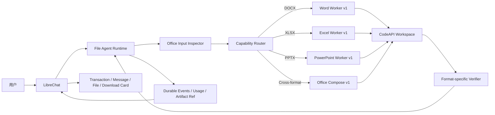

# File Agent Runtime Office M3.1 架构设计

Date: 2026-08-04

Status: technical reference; batch and release planning superseded.

The authoritative unified scope is
`docs/FILE_AGENT_RUNTIME_M3_M31_UNIFIED_BATCH_PLAN.md`. This document retains
the M3.1 capability and safety design, but its separate release-batch wording
must not be used for planning, packaging, or deployment.

## 一、版本定位

M3.1 是面向咨询公司办公场景的确定性 Office Worker Suite，不是动态代码 Agent。

```text
M3-R
  = 已冻结的 Word Worker 受控发布轨道

M3.1
  = Word + Excel + PowerPoint + 跨格式组合的确定性 Worker 套件

M4
  = Worker 无法覆盖时的任务级受控 Script 模式
```

M3.1 复用 M3 的 Runtime、Connector、任务状态、Workspace、计费、恢复、Verifier 和
artifact 交付，不修改 `office-file-agent.v1.1` / `word-edit-v1` 的既有语义。

## 二、目标用户与核心场景

目标用户是需要反复处理客户材料、分析模型和汇报文件的咨询、研究及企业办公人员。

M3.1 接纳以下核心场景：

1. 修改 Word 报告中的明确文字、追加段落和指定表格单元格；
2. 读取 Excel 数据结构，修改数据、公式、样式和工作表；
3. 修改现有 PPTX 的文字、表格、图片、页面顺序和基础布局；
4. 根据已授权 Excel/Word 数据生成一个完整 PPTX；
5. 在一个持久任务中检查多个 Office 输入，生成一个主要 Office 输出；
6. 对生成物执行格式、结构、业务断言和渲染验证后，通过 LibreChat 下载卡交付。

M3.1 的目标是可预测地完成高频办公交付，不承诺覆盖 Office 桌面应用的全部功能。

本版本中的 Word、Excel 和 PowerPoint 分别指 `.docx`、`.xlsx` 和 `.pptx`。旧二进制
`.doc`、`.xls`、`.ppt` 以及含宏格式不在 M3.1 支持范围。

## 三、总体架构



责任边界：

- LibreChat 继续负责用户、权限、会话、上传文件、模型价格、交易、消息和下载卡；
- Runtime 负责任务、计划、上下文、Worker 编排、恢复、进展和停止；
- CodeAPI 继续负责 `/mnt/data` 文件和命令执行；
- 各格式 Worker 只执行白名单结构化操作；
- 各格式 Verifier 独立判断候选文件是否可交付；
- Office Compose 只编排已注册 Worker，不生成任意 Python/JavaScript；
- M3.1 不新增第二套上传、文件库、计费或消息系统。

## 四、版本化契约

M3.1 新增 `office-file-agent.v1.2`，保留并兼容现有 v1/v1.1。

Capability profiles：

```text
word-edit-v1       # M3 冻结能力，语义不变
xlsx-edit-v1       # M3.1 Excel Worker
pptx-edit-v1       # M3.1 PowerPoint Worker
office-compose-v1  # M3.1 跨格式编排
```

M3.1 默认限制：

```text
maxInputFiles: 3
maxVisibleArtifacts: 1
maxPrimaryOutputs: 1
maxContextCharacters: 12000
```

用户明确要求多个独立文件时，继续受产品最大三个可见文件约束，但 M3.1 首个候选只
验收一个主要输出。不得将多页 PPT 拆成多个单页 PPTX，也不提供 ZIP fallback。

## 五、统一任务流程

```text
prepare
-> inspect all authorized inputs
-> classify supported/unsupported Office features
-> freeze structured acceptance assertions
-> choose one capability profile
-> plan registered Worker actions
-> execute against stable candidate
-> format-specific verify
-> bounded repair when assertions improve
-> publish one verified primary artifact
```

关键规则：

- 输入在任务初始化后只读；
- 先检查 Office 特性，再决定是否进入 Runtime，不能执行到一半才发现宏或复杂对象；
- Worker Action 只携带结构化参数，不携带 shell、脚本、绝对路径、URL 或凭据；
- 同一输出使用稳定 logical ID、路径和 revision；
- candidate hash 变化不能单独算进展；
- 没有对应 Verifier 的修改请求不得进入 M3.1；
- Runtime 接受 task 后失败关闭，不自动回退旧 Agent 双跑。

## 六、Workspace

```text
/mnt/data/.agent/<taskId>/
  input/
    source-1.<ext>
    source-2.<ext>
    source-3.<ext>
  scripts/
    word_worker.py
    xlsx_worker.py
    pptx_worker.py
    office_compose.py
    verifiers/
  internal/
    inspections/
    source-snapshots/
    verification/
    render/
    worker-history.json
  output/
    working.<ext>
```

每个任务只实例化所需 Worker。所有稳定 Worker 由 Runtime 提供固定版本和 SHA-256，
模型不能修改这些程序。`input/` 只读，`internal/` 不发布，`output/working.<ext>` 是唯一
主要候选。

## 七、Word 能力

M3.1 直接复用 M3 的 `word-edit-v1`，不借升级之名扩大能力：

- 检查段落、表格、已有样式、页眉页脚和基础 OOXML；
- 文字替换；
- 段落追加，可引用已有样式；
- 指定表格单元格替换；
- OOXML、关系、批注孤儿、业务断言和渲染验证；
- 一个 DOCX 输入和一个 DOCX 输出。

复杂修订痕迹、批注编辑、任意结构重排、宏、嵌入对象和像素级桌面一致性不属于
M3.1。需要扩展时新增 `word-edit-v2`，不能修改 v1 语义。

## 八、Excel 能力

### 8.1 Worker

Worker IDs：

```text
xlsx.inspect.v1
xlsx.transform.v1
xlsx.patch.v1
xlsx.validate.v1
```

接纳操作：

- 检查 Sheet、used range、单元格类型、公式、命名区域、合并单元格、表格和关键样式；
- 读取验收所需的有限数据范围，不把完整工作簿正文放入模型上下文；
- 修改指定单元格值或公式；
- 增加、重命名、排序和删除明确授权的工作表；
- 设置明确范围的数字格式、字体、填充、边框、对齐、行高和列宽；
- 创建或更新基础 Excel Table 和基础图表；
- 保留未授权区域、公式和工作簿结构；
- 生成一个 `.xlsx` 候选。

首版拒绝或转 `needs_input`：

- `.xls`、`.xlsm`、VBA；
- Power Query、外部数据连接、数据模型；
- 复杂透视表、切片器和第三方扩展；
- 需要 Excel 计算引擎才能确认结果但运行环境无法重算的公式；
- 无法证明可保留的签名、保护或不支持 OOXML 部件。

### 8.2 Verifier

`xlsx-structure-v1` 至少验证：

```text
ooxml.zip.valid
xlsx.workbook.openable
xlsx.relationships.resolved
xlsx.required_sheets.present
xlsx.required_changes.applied
xlsx.protected_regions.unchanged
xlsx.formulas.preserved
xlsx.named_ranges.valid
xlsx.render.succeeded
```

对未要求修改的关键范围保存规范化快照，而不是比较整个 ZIP 二进制。公式值是否正确
必须区分“公式文本正确”和“已由可信计算引擎重算”，不能把缓存值当成实时计算结果。

## 九、PowerPoint 能力

### 9.1 Worker

Worker IDs：

```text
pptx.inspect.v1
pptx.transform.v1
pptx.patch.v1
pptx.validate.v1
```

接纳操作：

- 检查页面数量、顺序、layout、文本框、表格、图片、notes、theme 和 media 引用；
- 修改指定页面的文字、表格数据和已有图片；
- 增删、复制和调整页面顺序；
- 使用批准的基础 layout 创建页面；
- 根据已授权 Excel/Word 数据生成一个完整 PPTX；
- 使用用户上传图片，不调用图片生成；
- 保存一个稳定的 `.pptx` 候选。

M3.1 不接纳：

- 每页生成一个独立 PPTX；
- 新图片生成；
- 宏、嵌入程序、复杂动画和交互对象；
- 未提供字体环境时承诺跨设备像素一致；
- 仅凭“文件可打开”宣称达到专业设计质量。

### 9.2 Verifier

`pptx-structure-v1` 至少验证：

```text
ooxml.zip.valid
pptx.presentation.openable
pptx.slide_order.valid
pptx.relationships.resolved
pptx.media.resolved
pptx.required_sections.present
pptx.source_values.traceable
pptx.all_slides.rendered
pptx.basic_overflow_check.passed
```

全部页面必须渲染。结构正确、内容断言通过和视觉质量是三种不同证据；基础溢出检查
通过不等于专业设计验收通过。

## 十、跨格式 Office Compose

`office-compose-v1` 只编排已注册 Worker，首版接纳：

```text
XLSX -> PPTX
DOCX -> PPTX
XLSX + DOCX -> PPTX
```

流程：

1. 各输入由自己的 Inspector 生成结构化 source facts；
2. Runtime 冻结来源映射、输出章节和业务断言；
3. Compose 生成 PPT Action plan，不把输入全文复制进 Prompt；
4. PPTX Worker 生成或修改一个完整演示文稿；
5. Verifier 检查关键值、章节、来源映射、渲染和溢出；
6. 只交付最终 PPTX，source facts、渲染图和中间文件留在 internal。

M3.1 不支持任意格式转换图，也不自动把 PDF 或图片 OCR 结果视为可信结构化数据。

## 十一、Acceptance Resolver

进入 Runtime 前必须把用户要求解析成冻结的结构化断言。M3.1 至少支持：

- Excel 目标 Sheet/范围、预期值、公式、样式和保留区域；
- PPT 目标页或章节、页数范围、必含标题、关键数据、来源引用和输出文件名；
- 跨格式来源文件、来源 Sheet/章节与目标 PPT 章节的映射；
- 一个主要输出的 MIME、logical ID 和文件名。

指令存在歧义、要求未支持特性、无法定义可验证结果或超出输入/输出上限时，Resolver
必须返回原生路径或 `needs_input`，不能猜测、静默删减要求或让模型自行定义验收条件。

## 十二、恢复、计费与交付

- 每个 model call、Worker item、usage、artifact 和 delivery 保持现有幂等语义；
- 同一 task 跨轮次继续使用相同 workspace 和候选文件；
- stale CodeAPI ref 通过现有 rebind 契约恢复，不创建第二个 task；
- Runtime 只报告输入、缓存读、缓存写和输出 Token；
- LibreChat 使用提交时 billing snapshot 计算费用；
- 只有 Verifier passed 的一个主要 artifact 进入 `processCodeOutput()`；
- 文件、assistant message、final event 和 generation job 完成后才结束“生成中”。

## 十三、统一批次边界

M3 Word 与 M3.1 Excel、PPTX、Compose 属于同一个开发批次和一个客户可见候选。
它们共享 Runtime、Connector、计费、交付、恢复和双服务回滚实现，不创建
独立的 M3-R 发布记录或 M3.1 发布记录。

- M3 Word 必须保持 `word-edit-v1` 语义并通过全量回归；
- Excel、PPTX 和 Compose 必须分别完成自己的非生产验收；
- 旧 PPT/CodeAPI 成功记录不能替代 M3.1 Runtime 验收；
- M4 Script 模式仍不属于当前批次；
- 最终候选统一执行一次 LibreChat release governance、回滚和业务验收。

## 十四、完成标准

M3.1 只有同时满足以下条件才算开发完成：

1. `word-edit-v1` 全量回归通过且语义未改变；
2. XLSX POC 升级为 `xlsx-edit-v1` Worker/Verifier，而不是继续使用固定 marker 演示；
3. `pptx-edit-v1` 完成修改、生成、渲染和基础溢出验证；
4. `office-compose-v1` 完成至少一个真实数据到完整 PPTX 的固定 fixture；
5. unsupported feature scanner 在产生文件副作用前失败关闭；
6. Runtime、Connector、普通聊天、计费、恢复和文件交付全量回归通过；
7. 真实非生产 Word、Excel、PPT 和跨格式任务分别形成可审计报告；
8. 未打包、未部署状态与生产候选状态分开记录。
