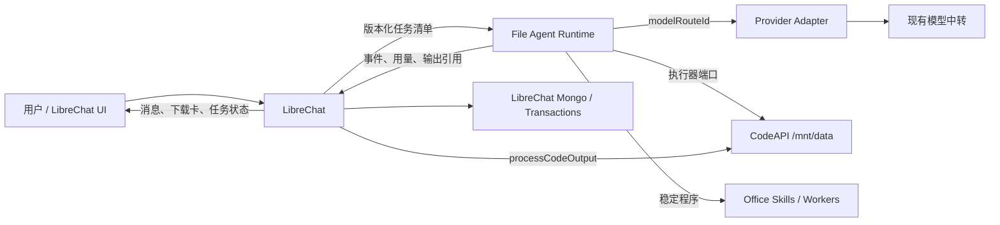
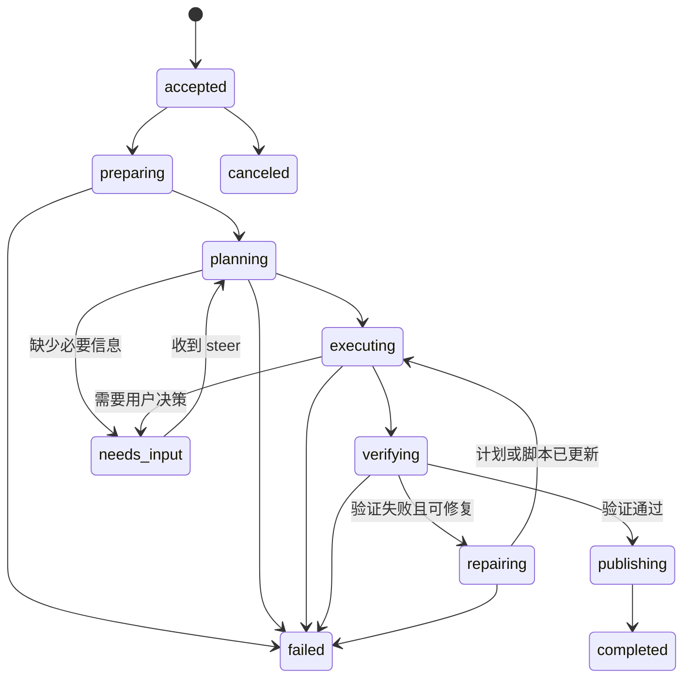

# 独立文件 Agent Runtime 架构设计

Date: 2026-07-23

Status: architecture approved. Phase 0 and the isolated Phase 1 CodeAPI POC are
implemented and locally verified; there is no production traffic, integration,
or deployment. Implementation records:
`docs/FILE_AGENT_RUNTIME_PHASE0_IMPLEMENTATION.md` and
`docs/FILE_AGENT_RUNTIME_PHASE1_IMPLEMENTATION.md`.

## 一、决策摘要

采用低耦合混合架构：LibreChat 继续负责聊天产品，复杂 Office 和文件任务交给
独立部署的 File Agent Runtime。

责任边界如下：

- LibreChat 负责用户、登录、权限、会话、消息、附件、模型选择、价格、计费、
  下载卡和前端状态；
- File Agent Runtime 负责任务状态、计划、上下文投影、模型循环、脚本增量修改、
  CodeAPI 执行、验证、恢复和进展判断；
- CodeAPI 继续负责 `/mnt/data` 工作区、命令执行和文件读写；
- Office Skill / Worker 负责版本化的 Excel、Word、PPT、PDF 处理和验证程序；
- 生成物继续通过 LibreChat 现有 `processCodeOutput()` 持久化，不建立第二套文件库；
- Runtime 不导入 LibreChat 源码，不读写 LibreChat Mongo，不持有消息 schema，
  不直接生成用户可见消息或下载卡；
- 不复用、不嵌入 Codex app-server、Codex SDK 或 Codex 私有协议。Codex 仅作为
  持久任务、分阶段事件、上下文压缩和恢复机制的公开架构参考。

模型侧由 Runtime 使用独立的 OpenAI-compatible Provider Adapter，通过独立受限
密钥访问现有模型中转。任务只传 `modelRouteId`，不传 URL、API Key 或价格。
LibreChat 仍是价格和交易的唯一权威来源。

## 二、拆分原因

问题样本 `4ba5e3cd-a659-4cae-b2e7-40b1f2db83c5` 已确认：

- 多次发送 10K 至 20K 字符的完整 Excel 脚本；
- 遇到 `MergedCell`、目录不存在和临时脚本失效后，重新生成整份脚本；
- 工具输出、脚本和历史持续进入模型上下文；
- 对话上下文增长到约 25.8 万 / 36.1 万 Token；
- CodeAPI 最终成功生成文件，说明故障不在执行环境；
- 文件完成后，LibreChat 还可能因最终事件丢失而继续显示“生成中”。

根因是聊天运行与工程任务运行共用同一条状态链路。聊天消息适合表达需求和结果，
但不适合作为脚本、错误、检查点、验证结果和恢复状态的唯一存储。

拆分不是增加一套 Office 特例，而是为复杂文件任务建立稳定的执行边界。

## 三、设计原则

1. **低耦合**：服务只通过版本化 HTTP/JSON 协议和不透明引用交互。
2. **状态外置**：任务状态保存在 Runtime 工作区和任务存储中，不依赖聊天历史。
3. **文件不复制**：输入和输出继续使用 CodeAPI 引用与 `/mnt/data`。
4. **价格单一来源**：Runtime 只报告 Token 用量，LibreChat 负责价格和交易。
5. **完成状态持久化**：计算、附件持久化和消息完成是可恢复的独立阶段。
6. **增量修复**：脚本创建后优先补丁式修改，不在每次失败后重发完整脚本。
7. **按进展调度**：主要判断任务是否前进，固定调用次数只作最终安全边界。
8. **租户隔离**：任务携带签名、限时、最小权限的用户与文件范围。
9. **端口可替换**：模型、执行器、事件和生成物均通过 Adapter 接入。
10. **不侵入普通聊天**：未命中复杂文件路由时继续使用 LibreChat 原生链路。

## 四、总体架构



运行时依赖保持单向：

```text
LibreChat -> Runtime Task API
Runtime -> Model relay
Runtime -> CodeAPI
LibreChat -> CodeAPI artifact persistence
```

禁止出现：

```text
Runtime -> LibreChat source import
Runtime -> LibreChat Mongo
Runtime -> LibreChat internal model client
Runtime -> LibreChat message persistence
```

## 五、模块边界

| 模块 | 负责 | 不负责 |
| --- | --- | --- |
| LibreChat | 用户、权限、会话、任务路由、价格、交易、附件、消息、下载卡 | 长任务计划、脚本状态、错误恢复 |
| Runtime Task API | 接收任务、幂等、查询、取消、补充指令、事件游标 | 用户 UI、数据库直写 |
| Agent Core | 计划、阶段状态、上下文投影、进展判断、重新规划 | 文件永久存储、价格计算 |
| Provider Adapter | 模型协议、流式输出、工具调用、原始 usage | LibreChat 价格和余额 |
| Executor Adapter | CodeAPI session、命令、文件读写、进程终止 | 判断业务任务是否继续 |
| Office Worker | 版本化转换、修改、生成、格式验证 | 聊天、用户身份、计费 |
| LibreChat Connector | 任务提交、事件消费、usage 入账、artifact 持久化、最终消息 | Agent 内部规划 |

### 5.1 唯一事实源

| 数据 | 唯一事实源 | Runtime 是否复制 |
| --- | --- | --- |
| 用户、租户、角色 | LibreChat | 否，只接收短期 scope |
| Conversation、Message | LibreChat | 否，只保留不透明引用 |
| 上传文件记录与所有权 | LibreChat | 否 |
| CodeAPI 文件内容和执行 session | CodeAPI | 否，只保存 ref |
| 任务 plan、item、checkpoint | Runtime | 是 Runtime 自己的领域数据 |
| 模型端点凭据 | Runtime Secret Store / 现有中转 | 不进入任务和 LibreChat 消息 |
| 模型价格、余额、transaction | LibreChat | 否，只返回 usage |
| 用户可见生成文件 | LibreChat 文件记录 | 否，只返回 CodeAPI artifact ref |
| 用户可见最终回复 | LibreChat Message | 否 |

Runtime 的数据库只能保存任务领域数据，不能成为用户、聊天、文件、价格或交易的
第二权威来源。

### 5.2 现有 LibreChat 能力复用映射

| 现有能力 | 新架构中的位置 | 处理方式 |
| --- | --- | --- |
| `GenerationJobManager` | LibreChat 前端流与交付任务 | 保留，不作为 Runtime task store |
| Redis/in-memory job event replay | LibreChat 浏览器重连 | 保留；Runtime 另有持久事件游标 |
| `metadata.codeEnvRef` | Task input / artifact ref | 原样复用字段语义 |
| CodeAPI `/mnt/data` priming | Connector 提交前准备 | 保留，不增加上传链路 |
| `readSandboxFile()` / `writeSandboxFile()` | Executor Adapter 能力参考 | 通过 CodeAPI 协议使用，不导入实现 |
| `create_file` / `edit_file` | 普通 LibreChat Agent | 保留；Runtime 使用自己的稳定工具契约 |
| `processCodeOutput()` | artifact delivery | 继续作为生成物进入 LibreChat 的唯一入口 |
| current-thread ownership | 文件授权与会话隔离 | 保留并在提交任务前校验 |
| transaction token breakdown | usage ingestion | 保留输入、缓存读、缓存写、输出粒度 |
| Admin `tokenConfig` | 价格和计费快照 | 保留为唯一价格配置 |

### 5.3 候选方案耦合度

| 方案 | 运行时耦合 | 配置重复 | 故障隔离 | 结论 |
| --- | --- | --- | --- | --- |
| 把 Codex app-server 嵌入 LibreChat | 高 | 中 | 低 | 不采用 |
| 在 LibreChat API 进程内重写完整 Agent Runtime | 高 | 低 | 低 | 不采用 |
| 独立 Runtime，但每次模型调用回调 LibreChat Broker | 中高 | 低 | 中低 | 首版不采用 |
| 独立 Runtime，直接访问现有中转 | 低 | 少量 route 配置 | 高 | 采用 |
| LibreChat 与 Runtime 共用独立 Model Gateway | 中 | 低 | 高 | 规模扩大后评估 |

选择“独立 Runtime，直接访问现有中转”的关键不是代码量最少，而是 LibreChat
重启、升级或流量波动不会中断 Runtime 的模型循环。少量 `modelRouteId` 映射通过
独立 Secret Store 和 allowlist 管理，不能演变成第二套 Admin Panel。

## 六、任务 API

首版提供最小接口：

```text
POST /v1/tasks
GET  /v1/tasks/{taskId}
GET  /v1/tasks/{taskId}/events?after={sequence}
POST /v1/tasks/{taskId}/cancel
POST /v1/tasks/{taskId}/steer
```

`POST /v1/tasks` 必须支持 `Idempotency-Key`，由 LibreChat 使用以下字段生成：

```text
conversationId + userMessageId + attachmentDigest + taskContractVersion
```

重复提交返回相同 `taskId`，不能重复执行、重复计费或重复生成文件。

### 6.1 任务清单

任务清单是跨服务契约，不复制 LibreChat Message 对象：

```json
{
  "schemaVersion": "1.0",
  "taskContractVersion": "office-file-agent.v1",
  "taskType": "office_transform",
  "intent": "根据两个工作簿生成一份汇总 PPTX",
  "acceptance": [
    "输出一个可打开的 PPTX",
    "内容来自指定输入文件",
    "验证页数和关键标题"
  ],
  "identity": {
    "tenantScope": "opaque-tenant-scope",
    "userScope": "opaque-user-scope",
    "conversationRef": "opaque-conversation-ref",
    "messageRef": "opaque-message-ref"
  },
  "model": {
    "modelRouteId": "file-agent-primary",
    "capabilityProfile": "reasoning-tools-v1"
  },
  "billingRef": "opaque-billing-snapshot-ref",
  "execution": {
    "executor": "codeapi",
    "sessionId": "storage-session-id",
    "workspaceRoot": "/mnt/data/.agent/task-id"
  },
  "inputs": [
    {
      "logicalName": "source.xlsx",
      "librechatFileRef": "opaque-file-ref",
      "codeEnvRef": {
        "kind": "user",
        "id": "scoped-user-id",
        "storage_session_id": "storage-session-id",
        "file_id": "codeapi-file-id"
      },
      "sha256": "optional-content-hash",
      "mimeType": "application/vnd.openxmlformats-officedocument.spreadsheetml.sheet"
    }
  ],
  "limits": {
    "maxVisibleArtifacts": 3,
    "maxWallTimeSeconds": 900,
    "maxContextTokens": 180000
  }
}
```

任务清单不得包含模型 API Key、数据库 ID、价格表、完整用户对象或历史消息数组。

`steer` 只追加新要求，不替换既有任务身份和输入授权：

```json
{
  "instructionId": "uuid",
  "text": "保留原工作簿公式，只修改样式",
  "createdAt": "2026-07-23T10:00:00Z"
}
```

Runtime 在下一个安全检查点读取指令并生成新的 plan revision。

## 七、事件协议

事件必须持久化并带单调递增 `sequence`。SSE 或 webhook 只能加速通知，不能作为
唯一事实来源。LibreChat 断线后从最后一个 sequence 继续查询。

```json
{
  "schemaVersion": "1.0",
  "taskId": "uuid",
  "sequence": 18,
  "eventId": "uuid",
  "type": "item.completed",
  "createdAt": "2026-07-23T10:02:31Z",
  "phase": "executing",
  "item": {
    "itemId": "uuid",
    "kind": "command_execution",
    "status": "completed",
    "summary": "已修改并运行 scripts/build_report.py",
    "detailsRef": "workspace://items/item-id.json"
  }
}
```

首版事件类型：

```text
task.accepted
task.phase_changed
task.steered
plan.updated
item.started
item.completed
item.failed
context.compacted
usage.recorded
artifact.ready
task.needs_input
task.completed
task.failed
task.canceled
```

事件正文只携带摘要和引用。完整 stdout、脚本、原始模型响应和大型错误清单保存在
工作区，不进入 LibreChat 消息和 SSE 缓冲区。

## 八、状态机与可靠收尾



Runtime 的 `completed` 表示计算完成并产生已验证的 CodeAPI 输出引用。

LibreChat 另行维护交付状态：

```text
submitted -> running -> delivering -> completed
                              -> delivery_retry
                              -> delivery_failed
```

只有 LibreChat 完成以下动作后，前端才结束“生成中”：

1. 消费持久 `task.completed`；
2. 通过 `processCodeOutput()` 持久化需要展示的输出；
3. 保存 assistant 消息和附件关系；
4. 保存 LibreChat 自己的最终事件；
5. 再向客户端发送 final。

即使瞬时 SSE 丢失，刷新或后台 reconciler 仍能根据持久状态补齐下载卡和最终回复。

## 九、持久任务工作区

```text
/mnt/data/.agent/<task-id>/
  task.json
  plan.json
  state.json
  inputs/
  scripts/
  outputs/
  items/
  logs/
  verification.json
  errors.json
  context-summary.md
```

约束：

- `inputs/` 只包含任务授权的文件引用或挂载；
- `scripts/` 中脚本拥有稳定路径和内容哈希；
- 每次修复记录 patch、旧哈希和新哈希；
- `outputs/` 只放候选交付物，不把中间调试文件暴露给用户；
- `items/` 保存模型步骤、命令、结果摘要和引用；
- 详细日志不回填聊天历史；
- 工作区按租户、用户和任务授权访问，并配置 TTL 和审计记录。

## 十、Agent Core 执行模型

Runtime 向模型暴露稳定、与 Provider 无关的工具契约：

```text
list_files
read_file
write_file
patch_file
run_command
inspect_artifact
validate_artifact
publish_artifact
```

模型不能调用 LibreChat 的 `create_file`、`processCodeOutput` 或数据库接口。

执行规则：

1. 预检只读取文件结构、关键元数据和有限样本；
2. 创建一次稳定主脚本并保存到 `scripts/`；
3. 执行失败后读取相关行和错误上下文；
4. 使用 patch 修改已有脚本，不重新传输整份脚本；
5. 生成候选文件后进入验证阶段；
6. 验证通过后发布 CodeAPI artifact ref；
7. 已有合格输出时不得继续无目的生成。

Office 通用机械逻辑逐步沉淀为版本化 Worker：

```text
office.inspect_workbook.v1
office.modify_workbook.v1
office.validate_workbook.v1
office.generate_presentation.v1
office.validate_presentation.v1
office.extract_document.v1
```

Agent 负责选择和组合 Worker，不重复生成每次相同的底层处理代码。

## 十一、上下文投影与压缩

每次模型调用只投影完成下一步所需的最小状态：

```text
任务目标和验收标准
当前 phase 和 plan revision
输入、脚本、输出文件清单及哈希
最近一个有效 item 的摘要
当前错误签名和相关代码片段
验证结果差异
剩余资源预算
```

默认不投影：

```text
完整聊天历史
完整旧脚本
完整 stdout/stderr
已解决错误的重复记录
大型文件全文
所有历史工具调用 JSON
```

压缩由投影预算和状态变化触发，不以固定工具次数为主要条件。压缩产物写入
`context-summary.md`，包含已完成事项、当前哈希、未解决问题、已否定方案、
下一步和验收条件。

原始事件仍保存在任务存储中，压缩只改变模型可见上下文，不删除审计证据。

## 十二、进展判断与重新规划

每个 item 完成后计算进展指纹：

```text
phase
planRevision
scriptHashes
outputHashes
verificationHash
normalizedErrorSignature
```

有效进展包括 phase 前进、脚本有效变化、输出哈希改变、验证失败项减少、错误签名
改变并接近验收标准，或用户补充必要要求。

无进展包括：

- 相同脚本哈希再次触发相同错误；
- 重新生成高度相似的完整脚本但验证状态不变；
- 已有合格文件后重复生成；
- 只增加日志和上下文，没有改变任务状态；
- 重复读取同一大文件范围但没有产生新结论。

处理顺序：

1. 第一次无进展：要求模型说明阻塞点并选择增量修复；
2. 连续相同指纹：强制重新规划，禁止重复执行同一动作；
3. 重新规划后仍无变化：转为 `needs_input` 或 `failed`，保留现有成果；
4. 最后才使用 wall time、Token、命令数和磁盘等硬上限熔断。

重复检测是状态判断，不是把正常任务限制为固定三次或五次工具调用。

## 十三、模型接入决策

### 13.1 采用：Runtime 直连现有中转

Runtime 内置窄接口 Provider Adapter：

```ts
interface ModelProvider {
  invoke(request: ModelRequest): Promise<ModelResult>;
}
```

任务只传 `modelRouteId`。Runtime 本地配置将其映射到：

```text
protocol
baseUrlSecretRef
apiKeySecretRef
model
capabilities
timeouts
```

优点：

- Runtime 不依赖 LibreChat API 是否在线；
- 不导入 LibreChat Provider 实现；
- 不让 LibreChat 承担长任务模型流量代理；
- 使用与 LibreChat 相同的现有中转，但密钥和限额独立；
- 后续可替换 Provider Adapter，不影响任务和文件协议。

控制措施：

- Runtime 使用单独的最小权限中转 Key；
- 不把 Key、base URL 或价格放入任务清单；
- `modelRouteId` 必须来自 Runtime allowlist；
- LibreChat 提交前校验 route 存在对应模型与价格配置；
- POC 只启用一个 route，不复制完整 Admin 模型管理功能。

### 13.2 暂不采用：LibreChat 模型代理接口

让 Runtime 每一步回调 LibreChat 获取模型响应会形成同步依赖：LibreChat 重启会
中断长任务，Runtime 的吞吐和恢复受聊天 API 约束，双方升级还要协调内部请求格式。
因此首版不建设 LibreChat Model Broker。

### 13.3 后续可选：独立共享 Model Gateway

如果未来端点显著增加，可把现有中转作为独立控制面统一管理。该 Gateway 应同时
服务 LibreChat 和 Runtime，而不是由其中一方托管另一方。此项不属于首版。

## 十四、CodeAPI 与文件接入

复用现有能力：

- LibreChat 稳定 `file_id`；
- `metadata.codeEnvRef.kind/id/storage_session_id/file_id`；
- 当前线程文件 priming；
- `/mnt/data`；
- CodeAPI scoped auth；
- `readSandboxFile()`、`writeSandboxFile()`；
- `processCodeOutput()` 和生成文件下载卡。

提交任务前，LibreChat Connector 负责校验文件所有权、把输入 priming 到同一个
CodeAPI session、生成签名限时的 task identity，并把稳定 refs 发送给 Runtime。

Runtime 只访问任务授权的 session 和文件，不得列举其他 session 或用户文件。

如果输入 session 失效：

- Runtime 发出 `input_ref_stale`；
- LibreChat 使用现有原文件重新 prime；
- 通过 `steer` 或幂等重绑更新 refs；
- Runtime 从最近检查点继续；
- Runtime 不直接读取 LibreChat 本地上传目录。

## 十五、生成物交付

Runtime 的 `artifact.ready` 只返回 CodeAPI 引用：

```json
{
  "type": "artifact.ready",
  "artifact": {
    "artifactId": "uuid",
    "name": "report.pptx",
    "mimeType": "application/vnd.openxmlformats-officedocument.presentationml.presentation",
    "bytes": 284193,
    "sha256": "hash",
    "codeEnvRef": {
      "storage_session_id": "session-id",
      "file_id": "codeapi-file-id"
    },
    "verification": {
      "status": "passed",
      "validator": "office.validate_presentation.v1"
    }
  }
}
```

LibreChat Connector 消费后调用现有 `processCodeOutput()`，完成下载保存、
`codeEnvRef` 保留、conversation/message 所有权、预览、assistant 附件和下载卡，
最后结束 LibreChat generation job。

Runtime 不返回浏览器文件 URL，不签发 LibreChat JWT，不操作消息附件数组。

## 十六、Token 与计费

Runtime 每次模型调用发出规范 usage：

```json
{
  "type": "usage.recorded",
  "usageEventId": "task-id:call-id",
  "taskId": "uuid",
  "callId": "uuid",
  "modelRouteId": "file-agent-primary",
  "providerModel": "gpt-5.6-sol",
  "inputTokens": 2010,
  "cacheReadTokens": 166400,
  "cacheWriteTokens": 0,
  "outputTokens": 1459,
  "occurredAt": "2026-07-23T10:02:00Z"
}
```

计费规则：

- Runtime 不计算美元费用；
- LibreChat 根据 `billingRef` 和提交时保存的模型价格版本计算；
- 每个 `usageEventId` 只入账一次；
- 保留输入、缓存读取、缓存写入和输出粒度；
- Agent 内部调用归入当前对话轮次和任务；
- 用户看板继续聚合 LibreChat 原生 transaction；
- 模型价格缺失时不允许新计费任务进入 Runtime，POC 非计费模式除外；
- 任务执行中价格变化时，当前任务使用提交时快照，新任务使用新价格。

LibreChat Connector 只增加窄的 usage ingestion adapter，不重做交易、余额或看板。

## 十七、多租户与安全

任务身份使用短期签名令牌，至少绑定：

```text
tenantScope
userScope
taskId
conversationRef
allowedSessionId
allowedFileIds
expiresAt
capabilities
```

安全要求：

- Runtime 不接受浏览器直接提交的 userId、tenantId 或 CodeAPI session；
- 只有 LibreChat 服务端可以创建任务；
- Runtime 与 CodeAPI 使用服务身份和任务范围声明；
- 每个 workspace 独立并阻止路径穿越；
- 命令、网络、CPU、内存、磁盘和 wall time 均有限额；
- 日志中的 Key、Authorization、文件正文和 PII 必须脱敏；
- artifact 只通过 LibreChat 权限校验后的下载接口交付；
- 取消任务必须终止 Runtime 循环和对应 CodeAPI 进程。

## 十八、故障恢复

| 故障 | 恢复方式 |
| --- | --- |
| 浏览器断线 | 重新订阅 GenerationJobManager；Connector 继续消费 Runtime 事件 |
| LibreChat API 重启 | 从持久 taskId 和 event sequence 恢复消费 |
| Runtime 重启 | 从 task store、workspace 和最后完成 item 恢复 |
| Runtime 通知丢失 | LibreChat reconciler 轮询 task 状态和事件游标 |
| CodeAPI 命令失败 | 保留脚本、错误签名和输出，增量修复后重跑 |
| CodeAPI session 失效 | Runtime 报 `input_ref_stale`，LibreChat 重新 prime 并重绑 |
| artifact 已生成但消息未完成 | Connector 重试 `processCodeOutput()` 后保存 final |
| usage 重复通知 | `usageEventId` 幂等去重 |
| 相同错误循环 | 进展指纹触发重新规划或 `needs_input` |
| 超出硬资源限制 | 保存成果和错误清单，停止后续计费调用 |

## 十九、复杂任务路由

进入 Runtime：

- 用户要求修改或生成 Office、PDF、Markdown 或数据文件；
- 需要读取多个文件并生成新文件；
- 需要跨表、跨页、跨文档计算或格式重构；
- 明确需要代码执行、验证和可下载交付物；
- 当前文件问答超过轻量预览能力。

继续 LibreChat 原生聊天：

- 无文件普通对话；
- 图片理解；
- 基于已提取短文本的简单问答；
- 不要求生成文件的轻量说明；
- 不需要持久工作区和多步验证的单次回复。

POC 阶段不使用模型自动分类。先用确定性规则和 feature flag，避免路由模型增加
延迟、Token 和不可解释性。

## 二十、实现边界

未来代码分为两个独立版本单元：

```text
services/file-agent-runtime/
  api/
  core/
  providers/
  executors/
  workers/
  store/
  tests/

LibreChat connector patch/module
  task-router
  runtime-client
  runtime-event-consumer
  usage-ingestion
  artifact-delivery
  task-reconciler
```

Runtime 独立构建、升级和回滚。LibreChat Connector 只依赖 `schemaVersion` 和
capability discovery，不依赖 Runtime 内部类或目录结构。

协议规则：新字段向后兼容；改变语义提升 major；提交前检查 capability；不支持的
task contract 返回明确 4xx；双方保留 requestId、taskId 和 eventId。

## 二十一、分阶段 POC

### Phase 0：协议和离线状态机

- 实现 task store、状态机、事件游标和 fake provider/executor；
- 验证幂等、重启恢复、取消、steer 和事件重放；
- 不接 LibreChat，不调用模型，不访问生产。

通过条件：相同 Idempotency-Key 不重复创建；重启后可续跑；通知丢失可按 sequence
补齐；`task.completed` 不依赖活跃 SSE。

### Phase 1：CodeAPI 文件 POC

- 只接非生产 CodeAPI session；
- 只支持 XLSX 检查、修改、验证和单个输出；
- 使用 fake model plan 或固定测试 plan；
- 验证脚本持久化、patch 修复和 artifact ref。

### Phase 2：单模型 Agent POC

- 只启用一个 `modelRouteId`；
- 使用独立测试 Key 和预算；
- 运行记录化夹具，不影子执行真实客户任务；
- 对比完整脚本重写次数、上下文 Token、耗时和成功率。

目标：主脚本创建一次；失败后只 patch；不重复执行相同错误和脚本；模型上下文不
包含完整历史 stdout；任务可恢复；artifact 验证后才发布。

### Phase 3：LibreChat 非生产集成

- 增加 Connector、usage ingestion 和 artifact delivery；
- 使用测试账号和测试 conversation；
- 模拟 Runtime、LibreChat 和浏览器分别断线；
- 证明文件生成后无需刷新即可结束，刷新也能恢复。

### Phase 4：受控生产试用

- 仅对 `vip998` 和显式 feature flag 开放；
- 每次验收至多执行一个计费文件任务；
- 保留原 LibreChat 文件链路作为回退；
- 达到验收指标后再扩大范围。

## 二十二、验收指标

功能：Office 文件可在一个任务中读取、修改、验证和下载；Runtime 输出成为原生
下载卡；生成文件继续进入“生成的文件”；用户和会话隔离不回退；取消、刷新和
服务重启可恢复。

效率：不重复传输完整脚本；详细工具输出不进入聊天上下文；失败修复复用工作区；
每次模型调用有 callId 和 usage；相同错误循环能停止。

计费：Token 粒度保持输入、缓存读、缓存写、输出；Runtime 不保存价格；usage
重放不重复扣费；对话轮次、实例和 Agent 内部调用继续在现有看板聚合。

运维：Runtime 与 LibreChat 可独立发布和回滚；Runtime 停止不影响普通聊天；
LibreChat 停止后 Runtime 可保存进度；不修改 CodeAPI 存储结构。

## 二十三、明确不做

首版不做：

- 复用 Codex app-server 或 Codex SDK；
- 把 Runtime 嵌进 LibreChat API 进程；
- 建设第二套用户、会话、文件、价格或余额系统；
- 让 Runtime 直接操作 LibreChat Mongo；
- 让浏览器直接连接 Runtime；
- 让 Runtime 返回公开下载 URL；
- 用固定三次或五次工具调用替代进展判断；
- 为每个 Office 请求硬编码模板脚本；
- 在 POC 前修改生产 Office 上传或 CodeAPI priming 链路。

## 二十四、结论

独立 File Agent Runtime 应是窄边界的任务执行服务，不是第二个 LibreChat，也不是
Codex app-server 包装层。

第一阶段重点不是增加更多工具，而是建立：持久任务状态、最小上下文投影、稳定
脚本与增量修复、进展感知与可恢复事件、LibreChat 权威的 artifact 交付和 usage
计费。

只有 Phase 0 至 Phase 3 在非生产环境通过后，才进入受控生产试用。

## 参考

- `docs/FILE_PIPELINE_SIMPLIFICATION_PLAN.md`
- `docs/CONTEXT_SAFETY_PLAN.md`
- `docs/PUBLIC_CODE_TOOL_CONTRACT_PLAN.md`
- `docs/AGENT_RUNTIME_CODEX_APP_SERVER_RESEARCH_BRIEF.md`
- https://learn.chatgpt.com/docs/app-server#api-overview
- https://learn.chatgpt.com/docs/app-server#items
